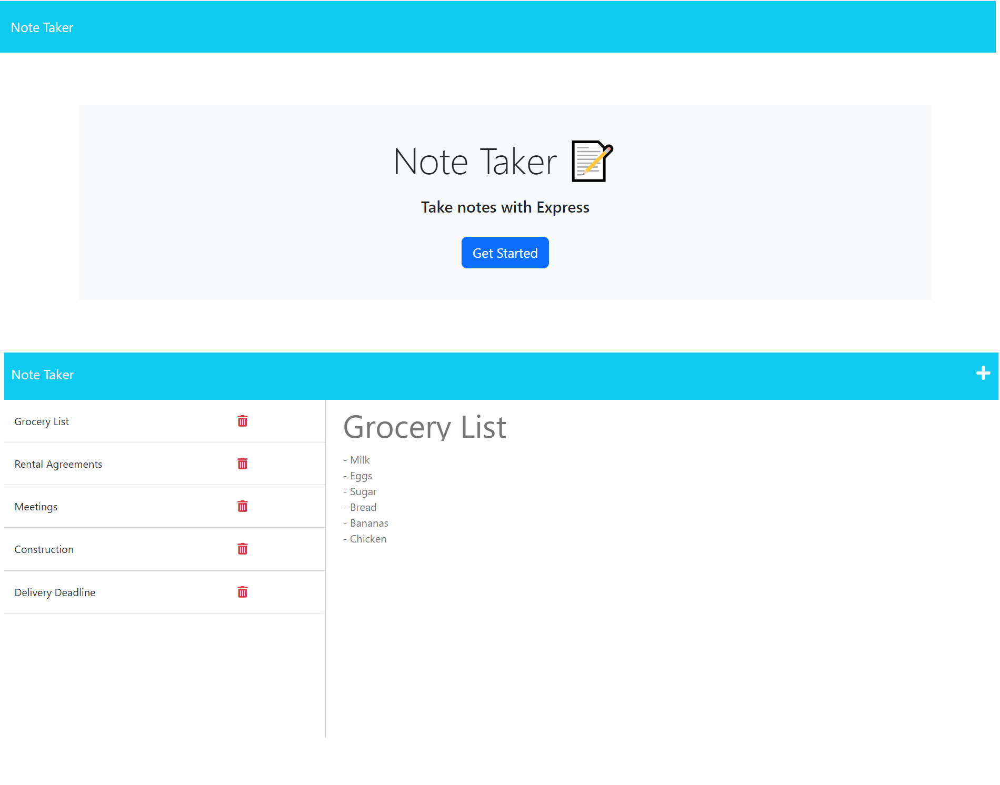

# *Note Taker Starter Code*

## *Description*
___
A note-taking application built using Express.js to write, save, view, and delete notes. Building this application has strengthened my skills in Javascript, Node.js, Express.js, server side communication, file structures, and deployment. The most challenging aspect when creating this application was understanding the starter code and exactly what it required for the code to function correctly. 

## *Table of Contents*
 ___
  - [Installation](#installation)
  - [Usage](#usage)
  - [Software](#software)
  - [License](#license)
  - [Questions](#questions)

## *Installation*
___
This application requires no installation. Note-taker is deployed at https://fathomless-mesa-59712.herokuapp.com/

## *Usage*
___
Step for using this application:
- Click and type your note into the text input area.
- To save your note, click the save icon on the top right of the webpage
- To view your note, click on the note you would like to view.
- To create a new note, click on the + icon to clear the text area.
- To delete your note, select the note you would like to delete and click the trashcan icon.

## *Software*
___
This application was created using the following software:
- HTML5 - Hypertext markup language - Structures a webpage
- CSS3
- Javascript ES6
- Node
- Express
- uuidv4
- VS Code

## *License*
___
This application is covered under the MIT license.
For more information about this license please visit https://opensource.org/licenses/MIT

## *Questions*
___
For questions or concerns please contact me via Github.
  - Github: https://github.com/ccooper9893
  - Github Repository: https://github.com/Ccooper9893/Note-Taker.git

